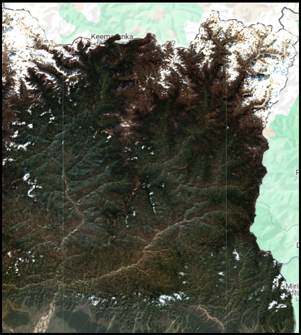
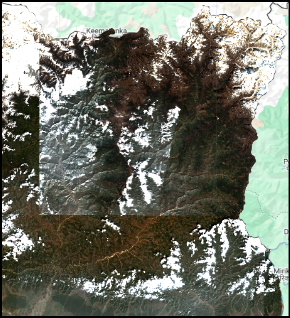

## Composite
A composite is a single image created by combining multiple satellite images using a statistical reducer such as median(), mean(), or min()
<div style="display: flex; align-items: center; justify-content: center; gap: 20px;">
  <!-- Median Image -->
  <div style="text-align: center;">
    
    <div><strong>Fig: Median Composite</strong></div>
  </div>

 <!-- VS with Down Arrow -->
  <div style="text-align: center; font-size: 24px; font-weight: bold; color: red;">
    VS<br>
    <span style="font-size: 35px;">&#8596;</span> <!-- Unicode Down Arrow -->
  </div>

  <!-- Mosaic Image -->
  <div style="text-align: center;">
    
    <div><strong>Fig: Mosaic Composite</strong></div>
  </div>
</div>

## Mosaic
A mosaic is an image formed by layering multiple images on top of each other, where the pixel values come from the first valid (non-null) image in the stack for each pixel location.

---

### Step 1: Load Area of Interest (Nepal Boundary)
```js
// Load GAUL Level 0 administrative boundaries and filter for Nepal
var nepal = ee.FeatureCollection('FAO/GAUL/2015/level0')
              .filter(ee.Filter.eq('ADM0_NAME', 'Nepal')).geometry();
```
---

### Step 2: Load Sentinel-2 Image Collection
```js
// Load Sentinel-2 Surface Reflectance Image Collection
var s2 = ee.ImageCollection('COPERNICUS/S2_SR_HARMONIZED')
        .filterDate('2025-01-01', '2025-02-28')
        .filterBounds(nepal)
        .filter(ee.Filter.lt('CLOUDY_PIXEL_PERCENTAGE', 10));

// Print the all available images id and properties
print(s2);
// Print Total no. of Image/Tles
print("The Totol no. of available images", s2.size());    
```

---

---

### Step 3: Creating Mosaics and Composites
* After filtering the image collection by date, cloud and region, we often want a **single image** for display or analysis. Earth Engine offers two common ways to do this:

---

### Option 1: `median()` — Composite for Cleaner Image
* Takes the **median value** for each pixel location across all images.
* Reduces cloud and haze effects.
* Great for **cloud-free, smooth images**.

```js
// Create median composite of filtered image collection
var s2Composite = s2.median();
```

---

### Option 2: `mosaic()` — Picks Top Image for Each Pixel
* Picks pixel values from the **top-most image** in the collection (based on time or order).
* Need the **most recent (or first) image** in each area.

```js
// Create a mosaic from filtered image collection
var s2Mosaic = s2.mosaic();
```

---

### Step 4: Clip Composite to Nepal Boundary
Crop the composite image so it only shows Nepal.
* `.clip()` Crop the Image to your area of Region.
```js
// Clip composite image to Nepal boundary
var clippeds2Median = s2Median.clip(nepal);
var clippeds2Mosaic = s2Mosaic.clip(nepal);
```

---

### Step 5: Visualization and Map Display
* Set RGB band visualization and display the final clipped image.
```js
// Center map on Nepal and add image to map
Map.centerObject(nepal, 7);
Map.addLayer(clippeds2Median, { bands: ['B4', 'B3', 'B2'], min: 0, max: 3000 }, 'Sentinel-2 Median Composite (Clipped)');
Map.addLayer(clippeds2Mosaic, { bands: ['B4', 'B3', 'B2'], min: 0, max: 3000 }, 'Sentinel-2 Mosaic Composite (Clipped)');
```

**Output:** A true color (RGB) Sentinel-2 median and mosaic composite image over Nepal with less than 10% cloud cover from January to February 2025, clipped to the Nepal boundary.

### ⚠️ Note:

>❗ **Clipping is not mandatory before Prosessing, Exporting image or while using Reducers.**

* When you **use the `region` parameter** (e.g., during export or reducer), Earth Engine **automatically limits** the operation to that region.
* So, **clipping before processing is optional**, and mainly used for **visual display** or when:

  * You want to **restrict further processing** only within that region.
  * You want to **reduce computation time** if working with large datasets.

---

### ✅ Best Practice

* Use `.clip()` **at the end**, mainly for display.
```js
Map.addLayer(s2Composite.clip(nepal), { bands: ['B4', 'B3', 'B2'], min: 0, max: 3000 }, 'Clipped Composite');
```
* Rely on `region` or `geometry` in `Export` and `Reducers` like to automatically focus on your desired area.


---
<a href="https://code.earthengine.google.com/0fda3bedd703f5b8971bab196b84b317?noload=true" target="_blank" style="display: inline-block; padding: 3px 6px; background-color: #0078d4; color: white; text-decoration: none; border-radius: 9px; font-weight: bold;">
  Open in Code Editor 🔗
</a>