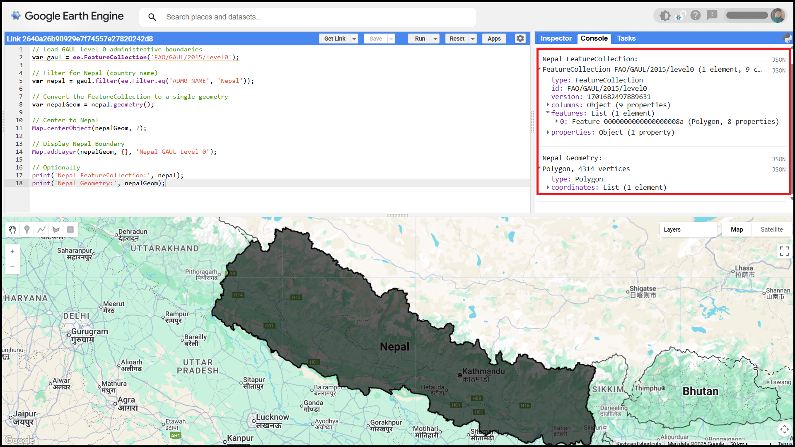

## Feature Collection
In Google Earth Engine, a **FeatureCollection** is a structured group of geographic features, where each feature includes a geometry (such as a point, line, or polygon) and a set of associated attributes or properties (like ID, name, land cover type, etc.). It is commonly used to handle vector data, such as administrative boundaries, sample locations, road networks or training data for classification. FeatureCollections can be manually created using tools like the geometry drawing tools in the Code Editor or by uploading external shapefiles or GeoJSON files. They are essential for tasks like masking, filtering, sampling, or training machine learning models using spatial data.
> The `ee.FeatureCollection()` syntax is used to create or load a FeatureCollection.


## **Load GAUL Administrative Boundaries**

---
### Step 1: Load GAUL Level 0 (Country Boundaries)
The **GAUL** dataset provides administrative boundaries. **Level 0** means country-level boundaries.
* `ee.FeatureCollection(...)`: Loads a set of geographic features.

```js
// Load GAUL Level 0 administrative boundaries
var gaul = ee.FeatureCollection('FAO/GAUL/2015/level0');
```

### Step 2: Filter Only Nepal
This filters the FeatureCollection to include only **Nepal** using the attribute `'ADM0_NAME'`.
* `.filter(ee.Filter.eq('attribute', 'value'))`: Filters features where an attribute equals a value.

```js
// Filter for Nepal (country name)
var nepal = gaul.filter(ee.Filter.eq('ADM0_NAME', 'Nepal'));
```

---

### Step 3: Get Geometry of Nepal
A FeatureCollection can contain multiple features. For visualization or spatial operations, we often extract a **single geometry**.
* `.geometry()` extracts the geometric shape of the feature(s).

```js
// Convert the FeatureCollection to a single geometry
var nepalGeom = nepal.geometry();
```

---

#### Step 4: Center the Map Over Nepal
This command zooms and centers the map around the geometry of Nepal.
* `Map.centerObject(object, zoomLevel)`: Centers map view.

```js
// Center to Nepal
Map.centerObject(nepalGeom, 7);
```

---

### Step 5: Display Nepal Boundary on Map
Add the **Nepal boundary** to the interactive map with optional styling.
* `Map.addLayer(geometry, style, label)` displays the layer.

```js
// Display Nepal Boundary
Map.addLayer(nepalGeom, {}, 'Nepal GAUL Level 0');
```

---

### Step 6: Print Outputs 
Use the **Console** to check the contents of the filtered data and geometry.
* `print(label, object)` outputs to the GEE Console.

```js
// Optionally
print('Nepal FeatureCollection:', nepal);
print('Nepal Geometry:', nepalGeom);
```

---

**Output:**
Displays all level 0 administrative boundaries of Nepal on the map.


<a href="https://code.earthengine.google.com/2640a26b90929e7f74557e27820242d8?noload=true" target="_blank" style="display: inline-block; padding: 3px 6px; background-color: #0078d4; color: white; text-decoration: none; border-radius: 9px; font-weight: bold;">
  Open in Code Editor 🔗
</a>

---