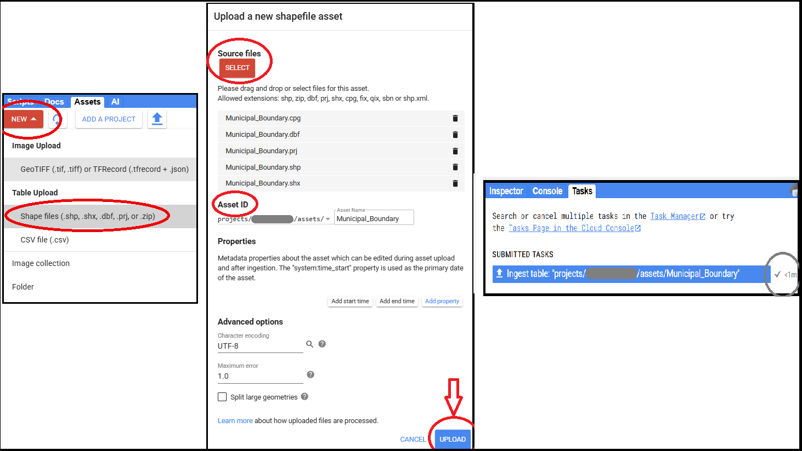

## **Import**
In GEE, importing means bringing external or GEE assets into your script to use them — like shapefiles, image collections, or tables.

### **Step-by-Step Process:**

**Step 1. Prepare your shapefile**
* Make sure file must includes these 4 files **in the same folder**:
   * `.shp`
   * `.shx`
   * `.dbf`
   * `.prj`

**Step 2. Convert to Earth Engine format using GEE Asset Uploader**
* a. Go to Earth Engine Assset.
* b. Click **“NEW” → “Shape files (SHP, SHX, DBF, PRJ)”**
* c. Select all **4 files**
* d. Set an **Asset ID**, e.g., `users/yourUsername/Municipal_Boundary`
* e. Click **Upload**



**Step 3. Wait for upload to finish**
* Shows progress and upload success in `Tasks Tab`
* Once complete, you will see it listed under your **Assets**.

 ##### Do **not zip** the files.
 ##### Same process for `Tiff` and `CSV` file.

**Step 4. Import into your script from Asset**
* Click on your imorted shapefile and just **click import**.
* You can see you shapefile is imported in script as name **table**.
* You can rename the name of table as your choice.
```js
var KMC = ee.FeatureCollection("users/yourUsername/Municipal_Boundary");
   ```

---

### **Export**

Exports are used to **download or save data** (images, tables, videos) to your **Google Drive**, **Cloud Storage**, or **Earth Engine Assets**.

---

### 1. Export an Image to Google Drive

```js
Export.image.toDrive({
  image: clippedComposite,      // Image to export
  description: 'Nepal_RGB_Composite',  // Task name
  folder: 'GEE_exports',        // Drive folder name (optional)
  fileNamePrefix: 'RGB_Nepal_May2025', // File name
  region: nepal,                // Export region
  scale: 10,                    // Spatial resolution in meters
  maxPixels: 1e13               // Limit to avoid errors
});
```

---

### 2. Export a FeatureCollection (e.g., shapefile) to Drive
```js
Export.table.toDrive({
  collection: nepal,                // FeatureCollection to export
  description: 'Nepal_Boundary_Export',
  fileFormat: 'SHP'                 // Can be CSV, GeoJSON, KML, SHP
});
```

---

### 3. Export Image to GEE Asset (for long-term storage)
```js
Export.image.toAsset({
  image: clippedComposite,
  description: 'Nepal_Composite_Asset',
  assetId: 'users/yourUsername/Nepal_Composite_2025',
  region: nepal,
  scale: 10,
  maxPixels: 1e13
});
```

---


<a href="https://code.earthengine.google.com/e16dfb7329bcfd4e58c75c6d93298f65?noload=true" target="_blank" style="display: inline-block; padding: 3px 6px; background-color: #0078d4; color: white; text-decoration: none; border-radius: 9px; font-weight: bold;">
  Open in Code Editor 🔗
</a>