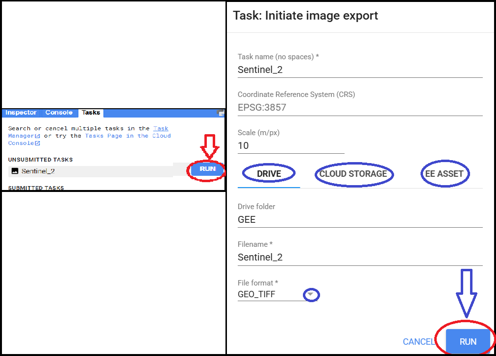

## **Import**
In Google Earth Engine (GEE), **importing** means bringing external data or GEE assets into your script so you can work with them. These assets can include **shapefiles (FeatureCollections)**,  **DEM rasters**, or **tables** (CSV). You can import your own data by uploading to your Earth Engine Assets using functions like `ee.FeatureCollection()`, and `ee.Image()`.

### **Step-by-Step Process:**

**Step 1. Prepare your shapefile**
* Make sure file must includes these 4 files **in the same folder**:
   * `.shp`
   * `.shx`
   * `.dbf`
   * `.prj`

**Step 2. Convert to Earth Engine format using GEE Asset Uploader**
* a. Go to Earth Engine Assset.
* b. Click **“NEW” → “Shape files (SHP, SHX, DBF, PRJ)”**
* c. Select all **4 files**
* d. Set an **Asset ID**, e.g., `users/yourUsername/Municipal_Boundary`
* e. Click **Upload**


**Step 3. Wait for upload to finish**
* Shows progress and upload success in `Tasks Tab`
* Once complete, you will see it listed under your **Assets**.

 ##### Do **not zip** the files.
 ##### Same process for `Tiff` and `CSV` file.

**Step 4. Import into your script from Asset**
* Click on your imorted shapefile and just **click import**.
* You can see you shapefile is imported in script as name **table**.
* You can rename the name of table as your choice.
```js
var KMC = ee.FeatureCollection("users/yourUsername/Municipal_Boundary");
   ```

---

### **Export**
Google Earth Engine (GEE) allows users to **export images, tables, videos, and charts** to external storage such as **Google Drive** `toDrive`, **Google Cloud Storage** `toCloudStorage` or **Earth Engine assets** `toAsset` for further use , storing or sharing.


Google Earth Engine allows exporting various outputs like **images**, **tables**, **videos**, and **charts** to external storage. Export destinations include:

* **Google Drive** using `Export.image.toDrive()`
* **Google Cloud Storage** using `Export.image.toCloudStorage()`
* **Earth Engine Assets** using `Export.image.toAsset()`

Export is essential when you want to **store**, **share**, or **use the data in other platforms like QGIS or ArcGIS**. You can also export **CSV tables**, **GIF animations**, or **charts**.


> When you specify the `region` parameter during export (e.g., `region: geometry`), Earth Engine **automatically clips** the image to that area **during the export process**. 

---
### 1. Load the area of imtrest that you have uploaded in Assets
```js
  // Change to your AOI
  var aoi = ee.FeatureCollection("projects/kessikushal/assets/Nepal_Boundary/Municipal_Boundary");
```

### 2. Load, filter, composite and Sentinel 2 Imagery
```js
  // Load Sentinel-2 Surface Reflectance Image Collection
  var s2 = ee.ImageCollection('COPERNICUS/S2_SR_HARMONIZED')
          .filterDate('2025-01-01', '2025-01-30')
          .filterBounds(aoi)
          .filter(ee.Filter.lt('CLOUDY_PIXEL_PERCENTAGE', 10))
          .median();

  // Print the all available images id and properties
  print(s2);

  // Center map on Nepal and add image to map
  Map.centerObject(aoi, 11);
  Map.addLayer(s2.clip(aoi), { bands: ['B4', 'B3', 'B2'], min: 0, max: 3000 }, 'S2 KMC');
```

### 3. Export Sentinel 2 Images of your Interest
Once you’ve created a composite or selected an image, you may want to export it for offline analysis, visualization or creating Map. 
```js
// Export to Google Drive (automatic region clipping)
Export.image.toDrive({
  image: s2,                  // Image to export
  description: 'Sentinel_2',  // Task name
  folder: 'GEE',              // Drive folder name (optional)
  fileNamePrefix: 'S2_KMC',   // File name
  region: aoi,                // Export region
  scale: 10,                  // Spatial resolution in meters
  maxPixels: 1e13             // Limit to avoid errors
});
```
After running the export code in Google Earth Engine, some tasks may appear as **unsubmitted** or **ready to run** in the Tasks tab. You need to:
  1. Open the **Tasks** tab in the GEE Code Editor.
  2. Check the task name and destination folder carefully.
  3. If needed, rename the task or folder for clarity.
  4. Then click **Run** to start the export process.

Similarly, you can export your images, tables, and videos to Earth Engine Assets or Google Cloud Storage for easy access and further analysis.

#### Note:
> You can extract only specific bands from an image using the .select() function. This is useful when exporting only necessary bands like RGB or specific indices.
```js
// Select only RGB bands (True Color)
var selectedBands = s2Composite.select(['B4', 'B3', 'B2']);
```

---
<a href="https://code.earthengine.google.com/59a4afa21c0ec593411278e96057edf6?noload=true" target="_blank" style="display: inline-block; padding: 3px 6px; background-color: #0078d4; color: white; text-decoration: none; border-radius: 9px; font-weight: bold;">
  Open in Code Editor 🔗
</a>