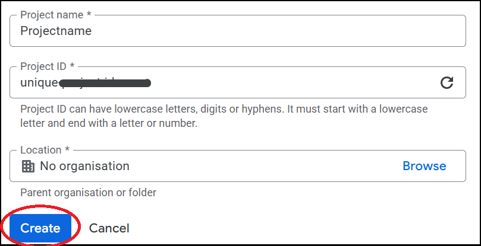
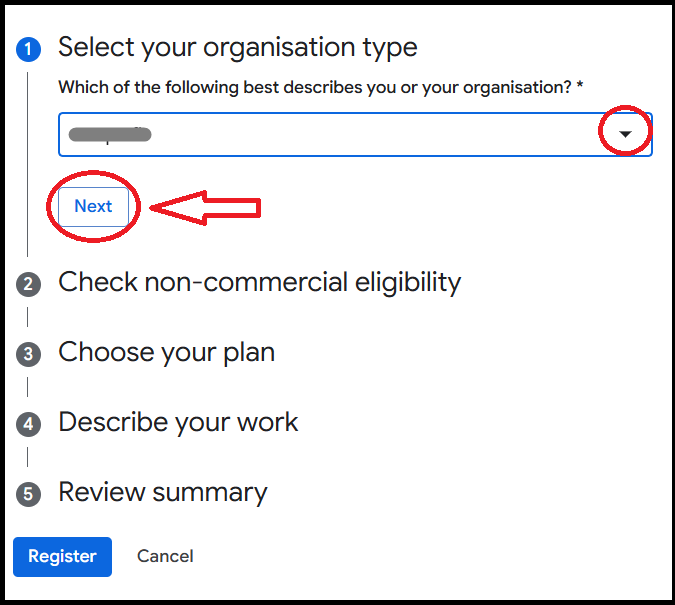

# Getting Started
---
### 1. How to Sign-Up for Google Earth Engine
<p style="text-align: justify;">
To access Google Earth Engine (GEE), users must have a registered account linked to a Google Cloud Project. There are two types of Google Cloud Projects available for GEE use: commercial and non-commercial. A non-commercial cloud project is intended for educational, research, or non-profit use and does not require billing information. It is free to use but comes with usage limits such as quotas on API calls and data exports. This option is suitable for students, researchers, and NGOs. On the other hand, a commercial cloud project is designed for business or enterprise-level applications and requires a billing account in Google Cloud. It provides higher usage limits and service-level support, suitable for large-scale or commercial deployments. In our case, we are using the non-commercial cloud project, which is sufficient for our educational and research purposes.
</p>

#### Choose a Sign-up Method
#### New GEE Users
1. Visit project registration page: https://code.earthengine.google.com/register.
2. Then, new interface appear.qq Click on **Create project** and follow below sign-in steps.

#### Existing GEE Users
1.  Visit Earth Engine Code Editor: https://code.earthengine.google.com and click on the your **account logo** and  select on **Register a new Cloud Project**.  

2. Then, new interface appear and Click on **Manage registration**.
3. Click on **Register a new project**.
4. Click on **New Project** that appear on right top and follow below sign-in steps.


#### Sign-up Steps
1. In the **New Project** tab. Give the **Project name**. Below Project name you will see the **Project ID** and at the end of sentences you will find **Edit** click on **Edit**. Give the unique project id which cannot be change lather and click on  **Create**.


2. Then, Choose non-commercial use and click on **Get started**.


#### We have to register the the cloud Project. So, fill all the question. <br> 
3. Add your **Organization type** 

4. Choose **No** on **Check non-commercial eligibility** then only other question appears
click on **Check eligibility** and click **Next** 


5. Click **Next** on **Choose Your plan**


6. **Describe your work**


7. At last check **Review summary** and click on **Register**. Then your project will be Registerd.
 
8. The last step is you have to **Enable Google Earth Engine API**. So, click on **Enable**


Now, go to **Earth Engine Code Editor**: https://code.earthengine.google.com. After opening if your interface is like this below you have to choose the **Cloud project**.


Click on **I'M AUTHORIZED FOR AN EXISTING CLOUD PROJECT**. Then, from dropdown choose the cloud project and click **Select**.   


If you are switching the cloud project then, click on the your **account logo** and  select on **Change Cloud Project** and choose any one project.

### 2. Exploring the GEE Code Editor Interface
The code editor has a map view, scripts , docs, Assets, console, Task and inspector tools. You will learn where to write code and view results.


### 3. Viewing Your First Map in GEE
Load your first satellite images in GEE visualize them with true color composites.<br>
<a href="https://code.earthengine.google.com" target="_blank" style="display: inline-block; padding: 3px 6px; background-color: #34a853; color: white; text-decoration: none; border-radius: 9px; font-weight: bold;">
  Earth Engine Code Editor 
</a>

```js
// Define the Area of Interest (AOI)
var aoi = ee.Geometry.Polygon(
        [[[85.14122639932727, 27.873219912886494],
          [85.14122639932727, 27.557129695472646],
          [85.48729573526477, 27.557129695472646],
          [85.48729573526477, 27.873219912886494]]]);


// Load and filter Sentinel-2 surface reflectance imagery
var imageCollection = ee.ImageCollection("COPERNICUS/S2_SR_HARMONIZED")
  .filter(ee.Filter.date("2025-01-01", "2025-05-30"))  // Filter by date
  .filter(ee.Filter.lt('CLOUDY_PIXEL_PERCENTAGE', 5)) // Filter cloudy images
  .median();                                           // Get median composite

// Visualization parameters 
var imageVisParam = {
  bands: ["B4", "B3", "B2"],      // True color bands: Red, Green, Blue
  min: 200,
  max: 1615,
};

// Add the processed image layer to the map
Map.centerObject(aoi, 8);
Map.addLayer(imageCollection, imageVisParam, "Sentinel 2");
```
<a href="https://code.earthengine.google.com/6dc851f31d6a747e5429905f2dab8fe5?noload=true" target="_blank" style="display: inline-block; padding: 3px 6px; background-color: #0078d4; color: white; text-decoration: none; border-radius: 9px; font-weight: bold;">
  Open in Code Editor 🔗
</a>

### 4. Navigating and Inspecting the Map
<p style="text-align: justify;">
Earth Engine Code Editor allows users to explore geospatial data interactively. You can zoom in and out using your mouse or trackpad and drag to pan across the map. By clicking on the map, you can inspect pixel values and retrieve detailed information about features in Inspector. The Layer Manager helps you toggle layers on or off, adjust opacity and organize visual outputs.
</p>