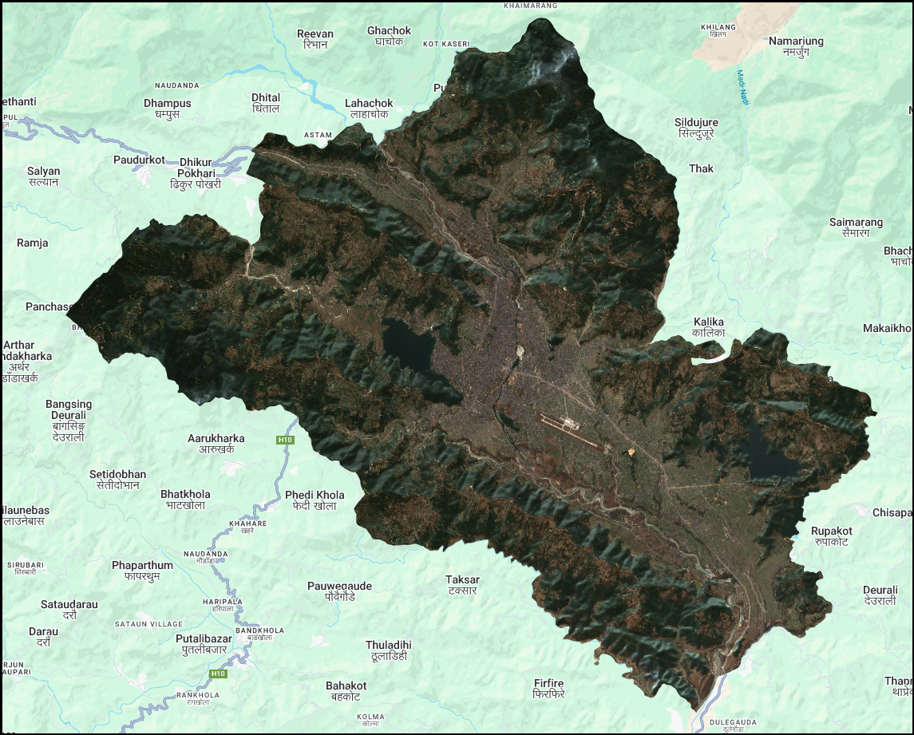
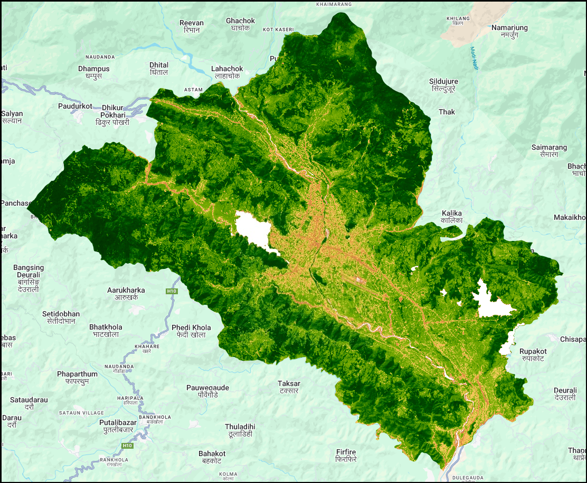

# **Calculating Indices in Remote Sensing**
Satellite indices are computed by performing mathematical operations on two or more spectral bands to highlight specific land surface features such as vegetation, water bodies, or urban areas. These indices are essential for extracting meaningful information from satellite imagery. In Google Earth Engine, two common methods for calculating indices are `normalizedDifference()` and the `expression()` function. The `normalizedDifference()` method simplifies the calculation of two-band indices using the formula $\frac{(Band1 - Band2)}{(Band1 + Band2)}$ and it returns values ranging from -1 to +1. This is useful for indices like NDVI, NDWI, or NDBI. On the other hand, the `expression()` function allows more flexibility by enabling users to write custom mathematical formulas involving multiple bands. Both methods are widely used to analyze surface features, monitor environmental changes, and perform classification tasks effectively in Earth observation workflows.

Here is a clean **bullet list with index name and formula** in Markdown (for VitePress), using MathJax:

---

#### Some Common Remote Sensing Indices
* NDVI (Normalized Difference Vegetation Index) = $\frac{(NIR - RED)}{(NIR + RED)}$
* NDWI (Normalized Difference Water Index) = $\frac{(GREEN - NIR)}{(GREEN + NIR)}$
* NDBI (Normalized Difference Built-up Index) = $\frac{(GREEN - NIR)}{(GREEN + NIR)}$
* SAVI (Soil Adjusted Vegetation Index) = $\frac{(NIR - RED) \cdot (1 + L)}{NIR + RED + L}$ <br>
  where $L = 0.5$ (default  value)
* NBR (Normalized Burn Ratio) = $\frac{(NIR - SWIR)}{(NIR + SWIR)}$
* BSI (Bare Soil Index) = $\frac{(SWIR + RED) - (NIR + BLUE)}{(SWIR + RED) + (NIR + BLUE)}$
* NDSI (Normalized Difference Snow Index) = $\frac{(Green - SWIR)}{(Green + SWIR)}$

<div style="display: flex; align-items: center; justify-content: center; gap: 5px;">
  <div style="text-align: center;">
    
    <div><strong>Fig: Median Composite</strong></div>
  </div>

  <div style="text-align: center; font-size: 20px; font-weight: bold; color: red;">
    VS<br>
    <span style="font-size: 35px;">&#8596;</span> <!-- Unicode Down Arrow -->
  </div>

  <div style="text-align: center;">
    
    <div><strong>Fig: NDVI Indices</strong></div>
  </div>
</div>

---
### Step 1: Load AOI and Image Collection
We first define the **Area of Interest (AOI)** and load **Sentinel-2 SR Harmonized** images filtered by date, cloud cover and location.

```js
// Load your area of interest
var municipality = ee.FeatureCollection("projects/kessikushal/assets/Nepal_Boundary/Nepal_Municipality");
var aoi = municipality.filter(ee.Filter.eq('GaPa_NaPa', 'Pokhara Lekhnath'));

// Load Sentinel-2 image collection and filter
var s2 = ee.ImageCollection('COPERNICUS/S2_SR_HARMONIZED')
  .filterBounds(aoi)
  .filterDate('2024-01-01', '2024-12-30')
  .filter(ee.Filter.lt('CLOUDY_PIXEL_PERCENTAGE', 10))
  .median();

// Add sentinel 2 to map
var rgbVis = {min: 0.0, max: 3000, bands: ['B4', 'B3', 'B2']};
Map.addLayer(s2.clip(aoi), rgbVis, 'Sentinel-2 RGB', 0);
```

---
### Step 2: Calculate NDVI using `.normalizedDifference`
NDVI highlights vegetation. It is calculated using Near-Infrared (B8) and Red (B4) bands.
```js
// METHOD 1: NDVI using normalizedDifference()
var ndvi = s2.normalizedDifference(['B8', 'B4']).rename('NDVI');
```
---
### Step 3: Visualize NDVI and add to Map
```js
// NDVI visualization parameters
var ndviVisParam = {
  min: 0,
  max: 1,
  palette: [
    'ffffff', 'ce7e45', 'df923d', 'f1b555', 'fcd163', '99b718', '74a901',
    '66a000', '529400', '3e8601', '207401', '056201', '004c00', '023b01',
    '012e01', '011d01', '011301'
  ]
};

// Add NDVI to Map
Map.addLayer(ndvi.clip(aoi), ndviVisParam, "NDVI");
```

---
### Step 4: Calculate NDWI using `.expression`
NDWI is useful for identifying surface water using the formula (Green - NIR) / (Green + NIR).

```js
// METHOD 2: NDWI using expression()
var ndwi = s2.expression(
  '(GREEN - NIR) / (GREEN + NIR)', {
    'GREEN': s2.select('B3'),
    'NIR': s2.select('B8')
  }).rename('NDWI');
```

---
### Step 5: Extract Water Bodies using a appropriate threshold
To identify threshold, click on a water containing pixel to check its NDWI value, then use that value as a threshold `(e.g., NDWI > 0)` to extract water bodies for your study area.
in this code we are using threshold value as 0.01.

```js
// Water mask (NDWI > 0.01)
var threshold = 0.01;
var water = ndwi.gt(threshold);
var water_masked = water.selfMask();
```
---
### Step 6: Visualize NDWI and maked Water Bodies
```js
// NDWI visualization parameters
var ndwiVisParam = {min:-0.7,max:0.1, palette:["#0a750e","#7af53d","f0fbe2","ffffff","1239ff"]};
var waterVisParam = {min:0, max:1, palette:["#ffffff","1229c7"]};
var water_maskedVisParam = {palette:["1229c7"]};

// Display layers on map
Map.addLayer(ndwi.clip(aoi), ndwiVisParam, 'NDWI');
Map.addLayer(water.clip(aoi), waterVisParam, 'Water vs non-water', 0);
Map.addLayer(water_masked.clip(aoi), water_maskedVisParam, 'Masked Water');
```
---
**Output:**
This code shows the 2024 vegetation Index (NDVI), and water bodies (NDWI and water mask) for the selected area (AOI).

<a href="https://code.earthengine.google.com/f571250d1ac58312d0d4c7191fb9b0fd?noload=true" target="_blank" style="display: inline-block; padding: 3px 6px; background-color: #0078d4; color: white; text-decoration: none; border-radius: 9px; font-weight: bold;">
  Open in Code Editor 🔗
</a>