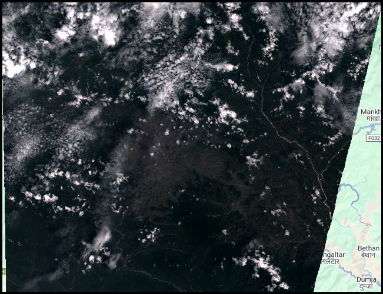
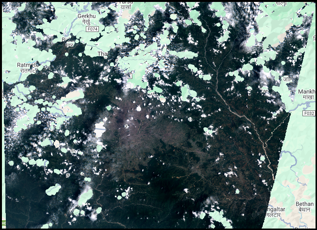
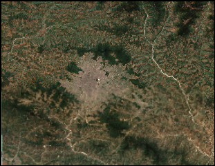

# **Cloud Masking in Sentinel 2**
Cloud masking is the technique of detecting and excluding cloud-covered or shadowed pixels in satellite imagery to ensure accurate analysis of surface features. In Sentinel-2 imagery, clouds can obscure the land surface and lead to misleading results. Google Earth Engine provides several ways to handle this, including the use of **QA60 quality assurance bands**, the **Cloud Probability (s2cloudless)** product, and algorithms like **Fmask**. These tools identify cloud-affected areas based on spectral signatures or probabilities and mask them out, allowing users to create cleaner mosaics and more reliable outputs for tasks such as vegetation monitoring, water detection, and land cover classification.

<div style="display: flex; align-items: center; justify-content: center; gap: 1px;">
  <div style="text-align: center;">
    
    <div><strong>Fig: Cloudy Image</strong></div>
  </div>

  <div style="text-align: center; font-size: 15px; font-weight: bold; color: red;">
    VS<br>
    <span style="font-size: 25px;">&#8596;</span> <!-- Unicode Down Arrow -->
  </div>

  <div style="text-align: center;">
    
    <div><strong>Fig:  Cloud-Masked</strong></div>
  </div>

  <div style="text-align: center; font-size: 15px; font-weight: bold; color: red;">
    VS<br>
    <span style="font-size: 25px;">&#8596;</span> <!-- Unicode Down Arrow -->
  </div>

  <div style="text-align: center;">
    
    <div><strong>Fig: Cloud-Score +</strong></div>
  </div>
</div>

### <u>**Method: 1**</u>

## **Cloud Masking in Sentinel-2**
Clouds often obstruct optical satellite imagery. Sentinel-2 provides a `QA60` band that helps identify cloud and cirrus contamination, allowing us to mask them for clearer analysis.

### Follow the Steps
---

---
### 1. Load the AOI (Kathmandu Valley shapefile)
```js
// AOI: Define region of interest
var aoi = ee.FeatureCollection("projects/kessikushal/assets/Nepal_Boundary/Kathmandu_Valley");
```

---
### 2. Load Sentinel-2 Images with High Cloud Cover
We purposely load cloudier images to demonstrate the effectiveness of masking.

```js
// Original Sentinel-2 Image (Most Cloudy)
var originalS2 = ee.ImageCollection('COPERNICUS/S2_HARMONIZED')
  .filterBounds(aoi)
  .filterDate('2025-03-01', '2025-04-30')
  .filter(ee.Filter.gt('CLOUDY_PIXEL_PERCENTAGE', 20));

// Sort by cloudiness descending and select the most cloudy image
var originalImage = originalS2.sort('CLOUDY_PIXEL_PERCENTAGE', false).first();
```

---
### 3. Visualize Cloudy Image
```js
// Display the original image
Map.centerObject(aoi, 9);
Map.addLayer(originalImage, 
  {bands: ['B4', 'B3', 'B2'], min: 800, max: 11000}, 
  'Original Sentinel-2 Image (Cloudy)', false);
```

---
### 4. Define Cloud Masking Function
This function takes a **Sentinel-2 image** and removes cloud and cirrus pixels using the **QA60 band**, which contains quality information.
```js
// Function to mask clouds using the Sentinel-2 QA band.
function maskS2clouds(image) {
  var qa = image.select('QA60');
```

* **Selects the QA60 band**, which stores cloud information in specific bits.
* This band is a **bitmask** – meaning each bit in the 16-bit band holds information about cloud, cirrus, etc.

---
```js
  // Bits 10 and 11 are clouds and cirrus, respectively.
  var cloudBitMask = 1 << 10;
  var cirrusBitMask = 1 << 11;
```
* **Bitwise shift operation** to define:
  * `cloudBitMask`: Bit 10 (value = 1024)
  * `cirrusBitMask`: Bit 11 (value = 2048)

These represent where **cloud** and **cirrus** information is stored in the QA60 band.

---
```js
  // Both flags should be set to zero, indicating clear conditions.
  var cloudMask = qa.bitwiseAnd(cloudBitMask).eq(0)
                    .and(qa.bitwiseAnd(cirrusBitMask).eq(0));
```
* This line checks if **both cloud and cirrus bits are OFF (0)**.
* `bitwiseAnd(...)` isolates each bit.
* `.eq(0)` checks that the bit is not set (i.e., no cloud/cirrus).
 Only pixels where **both bits are 0** are considered **cloud-free**.

---
```js
  // Return the masked and scaled data, without the QA bands.
  return image.updateMask(cloudMask)
              .select('B.*')
              .copyProperties(image, ['system:time_start']);
}
```

#### What this does:
1. `image.updateMask(cloudMask)`
   → Applies the cloud mask: only pixels without clouds/cirrus are kept.
2. `.select('B.*')`
   → Keeps only the optical bands like B2 (Blue), B3 (Green), etc.
   (Excludes QA60, which isn’t useful after masking.)
3. `.copyProperties(image, ['system:time_start'])`
   → Copies metadata (e.g., date/time of image) so we can still use it later (e.g., time series).

---

### 5. Apply Cloud Mask and Visualize Clean Image
```js
// Apply cloud mask to the selected image
var maskedImage = ee.Image(maskS2clouds(originalImage));

// Display the cloud-masked image
Map.addLayer(maskedImage, 
  {bands: ['B4', 'B3', 'B2'], min: 600, max: 3270}, 
  'Cloud-Masked Sentinel-2 Image');
```
---
<a href="https://code.earthengine.google.com/013b07f5cab38d1f78b3c820615b05c2?noload=true" target="_blank" style="display: inline-block; padding: 3px 6px; background-color: #0078d4; color: white; text-decoration: none; border-radius: 9px; font-weight: bold;">
  Open in Code Editor 🔗
</a>

---
### <u>**Method: 2**</u>

### Cloud Masking using **Cloud Score+ (CSP)** for Sentinel-2

Cloud Score+ is an advanced cloud probability product created by Google, compatible with **Sentinel-2**. It provides a **cloud probability value (0–1)** for each pixel, helping to **mask clouds more accurately** than bitmask methods (like `QA60`).

### Follow the Steps
---

### **Step 1: Load the AOI (Kathmandu Valley shapefile)**

```js
// AOI: Define region of interest
var aoi = ee.FeatureCollection("projects/kessikushal/assets/Nepal_Boundary/Kathmandu_Valley");
```
---
### **Step 2: Load Sentinel-2 SR Harmonized Collection**
```js
// Harmonized Sentinel-2 Level 2A collection
var s2 = ee.ImageCollection('COPERNICUS/S2_SR_HARMONIZED')
  .filterBounds(aoi)
  .filterDate('2025-01-01', '2025-06-01');
```

* Loads Sentinel-2 Surface Reflectance images.
---

### **Step 3: Load Cloud Score+ Collection**
```js
// Cloud Score+ image collection (from Sentinel-2 Level 1C)
var csPlus = ee.ImageCollection('GOOGLE/CLOUD_SCORE_PLUS/V1/S2_HARMONIZED');
```

* Loads Google’s Cloud Score+ product for the same region and time.
* **`cs`** shows how clear a pixel is in the moment, while **`cs_cdf`** shows how clear it is compared to all times—`cs` is more sensitive to haze/cloud edges, and `cs_cdf` gives more usable pixels by ignoring minor changes and shadows.

---
### **Step 4: Define QA Band and Threshold**
```js
// Set Cloud Score+ QA band and threshold
var QA_BAND = 'cs';
// The threshold for masking; values between 0.50 and 0.65 generally work well.
var CLEAR_THRESHOLD = 0.60;
```

* Uses the `cs_cdf` or `cs` band to determine cloudiness.

---
### **Step 5: Build Cloud-Free Composite**
```js
// Build clear-pixel composite
var clearComposite = s2
  .linkCollection(csPlus, [QA_BAND])
  .map(function(img) {
    return img.updateMask(img.select(QA_BAND).gte(CLEAR_THRESHOLD));
  })
  .median();
```

* `linkCollection()`: Aligns the cloud score image to each S2 image.
* `updateMask()`: Removes cloudy pixels based on the threshold.
* `median()`: Creates a clean, cloud-free composite from the image stack.

---
### **Step 6: Visualize Cloud-Free Composite**
```js
// Visualization parameters
var visParams = {
  bands: ['B4', 'B3', 'B2'],  // RGB
  min: 0,
  max: 2500
};

// Display on Map
Map.addLayer(clearComposite, visParams, 'Cloud-Free Median Composite (Jan–Jun 2025)');
```
---
Read [All Clear with Cloud Score+](https://medium.com/google-earth/all-clear-with-cloud-score-bd6ee2e2235e) to understand how Google’s Cloud Score+ improves cloud masking in Sentinel-2 imagery using pixel-wise cloud-free probabilities.

<a href="https://code.earthengine.google.com/0cb1e437ced083f9870f1bd875e0d538?noload=true" target="_blank" style="display: inline-block; padding: 3px 6px; background-color: #0078d4; color: white; text-decoration: none; border-radius: 9px; font-weight: bold;">
  Open in Code Editor 🔗
</a>