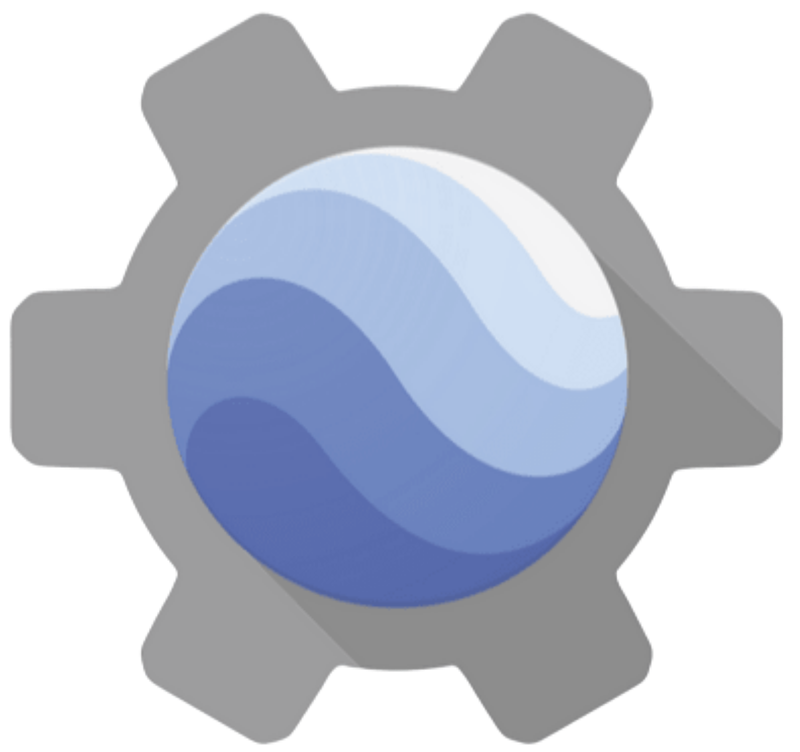

# Introduction
---

### 1. What is Google Earth Engine?
Google Earth Engine (GEE)  is a **cloud-based geospatial platform** that allows users to visualize, analyze and process satellite imagery and geospatial data using powerful cloud computing resources. Visit website [**Google Earth Engine**](https://earthengine.google.com/)

|  **Data** |  **Computation** |  **API** |  **Apps** |
| :------------ | :-------------- | :------------- | :------------- |
| Petabytes of imagery   MODIS, Landsat, Sentinel    Standard projection   Updated daily | Cloud-based processing   No need for powerful computers   Parallel processing across servers   Fast, scalable analysis | JavaScript (Code Editor)   Python (Colab, Jupyter)   Export results, charts | Earth Engine Apps   UI and Panel   Interactive Map   Publishing app |

### 2. What can do and cannot do using GEE?
| Can do ✅ | Cannot do ❌ |
| :------------ | :-------------- | 
|Image Processing   Vector Processing   Terrain Processing   Time series Analysis   Change Detection   Machine Learning   Objection Detection   Deep learning | Creating Cartographics Maps   3D Visualization and analysis   Hydrological Models and analysis   Photogrammetry   LIDAR processing   SAR Interferometry |

### 3. Real-world Applications of GEE

- Deforestation tracking  
- Urban growth analysis  
- Water body monitoring  
- Disaster risk mapping
- Change Detection

### 4. GEE for Beginners (No Coding Needed!)

Google Earth Engine offers user-friendly tools called **Earth Engine Apps** that let beginners explore and analyze satellite data without writing any code. These apps provide interactive maps, simple interfaces, and customizable panels, making it easy to visualize environmental changes, monitor land use, and perform basic analysis through clicks and menus—perfect for users new to programming.

&nbsp;

